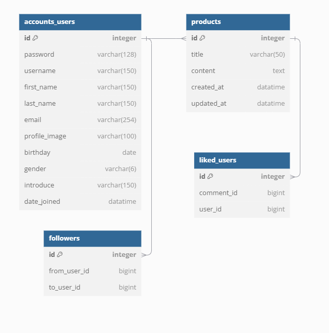

# Django_DRF 마켓 백엔드드 프로젝트

## 목차
1. [프로젝트 소개](#프로젝트-소개)
2. [기술 스택](#기술-스택)
3. [설치 및 실행 방법](#설치-및-실행-방법)
4. [주요 기능](#주요-기능)
5. [프로젝트 구조](#프로젝트-구조)
6. [웹페이지 구동 이미지](#웹페이지-구동-이미지) 
7. [문제 해결 및 배운 점](#문제-해결-및-배운-점)
8. [향후 계획](#향후-계획)

---

## 프로젝트 소개
Django_DRF를 활용해 개발한 마켓 웹페이지입니다. 
기본적인 웹페이지의 백엔드 기능을 구현하는 것에 초점을 맞춘 프로젝트이며, 
회원가입, 프로필 페이지 등 기본적인 유저기능과 
물품 조회,등록,수정,삭제하기 등 기본적인 게시기능 등을 구현하였습니다다. 

### 주요 기능
- MVP : 회원가입, 로그인, 로그아웃, 프로필페이지, 본인정보 수정
- 상품 관리 : 상품 등록, 수정, 삭제

**배포 URL:** [https:/http://127.0.0.1:8000/products/](https:/http://127.0.0.1:8000/products/)

---

## 기술 스택
- **언어:** Python 3.10.6
- **백엔드 프레임워크:** Django 4.2 , Django REST Framework
- **프론트엔드:** POSTMAN
- **데이터베이스:** SQLite (개발 단계), 
---

## 설치 및 실행 방법

### 1. 저장소 클론
```bash
git clone https://github.com/KUC23/drf_market.git
```

### 2. 가상환경 생성 및 패키지 설치
```bash
python -m venv venv
Windows: venv\Scripts\activate # mac : source venv/bin/activate  
pip install -r requirements.txt
```

### 3. 디렉토리 이동
```bash
cd drf_market
```

### 4. 데이터베이스 마이그레이션
```bash
python manage.py migrate
```

### 5. 서버 실행
```bash
python manage.py runserver
```

---

## 프로젝트 구조
```plaintext
new_spartamarket/
├── accounts/    # 사용자 인증 관련 앱
├── django_drf/  # 베이스 앱
├── media/profile_images # 프로필 이미지 폴더
├── products/    # 상품 관련 앱
└── manage.py    # Django 관리 스크립트
```
---
## ERD


---

## 문제 해결 및 배운 점

### 문제 1:로그아웃 실패  오류
- **해결 방법:**
-  `rest_framework_simplejwt.token_blacklist`,  # 블랙리스트 앱 추가

### 배운 점
- Django_DRF 의 기본적인 구조에 대해 좀더 이해하게됨
- 앱 설정 및 마이그레션의 중요성을 알게됨됨

---

## 향후 계획
- 가능하면 기존 프론트엔드와 합쳐 웹페이지 구현
- 필터링 기능 및 페이지네이션 기능 추가가
- 게시글 좋아요 기능 추가가
---

